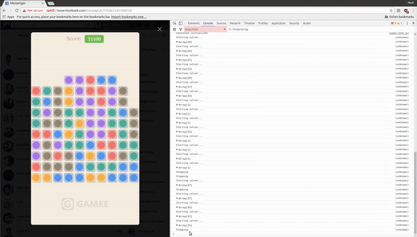

# BrickPop
Solver to play the Brick Pop game in Facebook Messenger.

100% automated bot that scores about 100,000 points per hour. Interacts with the canvas directly via JavaScript, with a Node.js server on the back end that runs the C++ solver.

## How to run:

First, run your server:

```
$ npm start
```

Open Chrome and start playing the BrickPop game (make sure to click "Play Now"). Open the console, select the dropdown, and choose "index.html". Now you can paste in the code from `play.js` into your console. Run `solve()` to start the solver, and run `stop = true` when you would like it to stop after finishing the current level. Happy brick popping!


